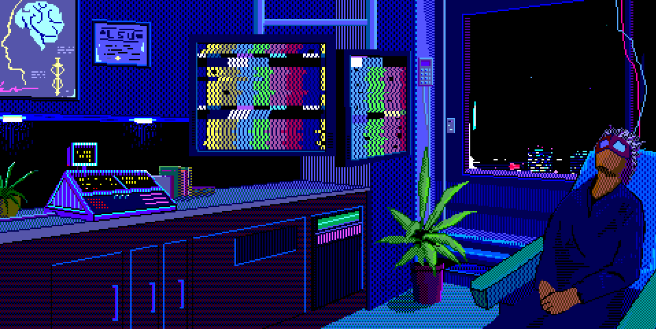

# nono Exercicio

## Oque Abordamos aqui

### neste exercicio aprendemos a lidar com imagens dinamicas:

#### como funciona
. Quando criamos nosso site devemos pensar na experiencia do usuario, po padrão quando adicionamos imagens elas nem sempre se ajustam aos diferentes tipos de tela por isso usamos a tag ```html <picture>```
#### pictures
. quando usamos a tag picture estamos dizendo ao html que queremos dinamizar nossas imagens:

```html
<picture>   
     
        <source media="(max-width:600px )" srcset="imagens/p.jpg" >
        <source media="(max-width:1050px )" srcset="imagens/m.jpg">

        
    </picture>
    
```

aqui usamos a tag <strong>source</strong> para elencar as imagens de tamanhos diferentes, deixando elas em oredem de tamnho definimos o tamanho ta tela pra que elas apareçam.
apos isso pronto temos uma imagen dinamica.


##### Muito Obrigado

>nehum direiro de imagem foi violado
